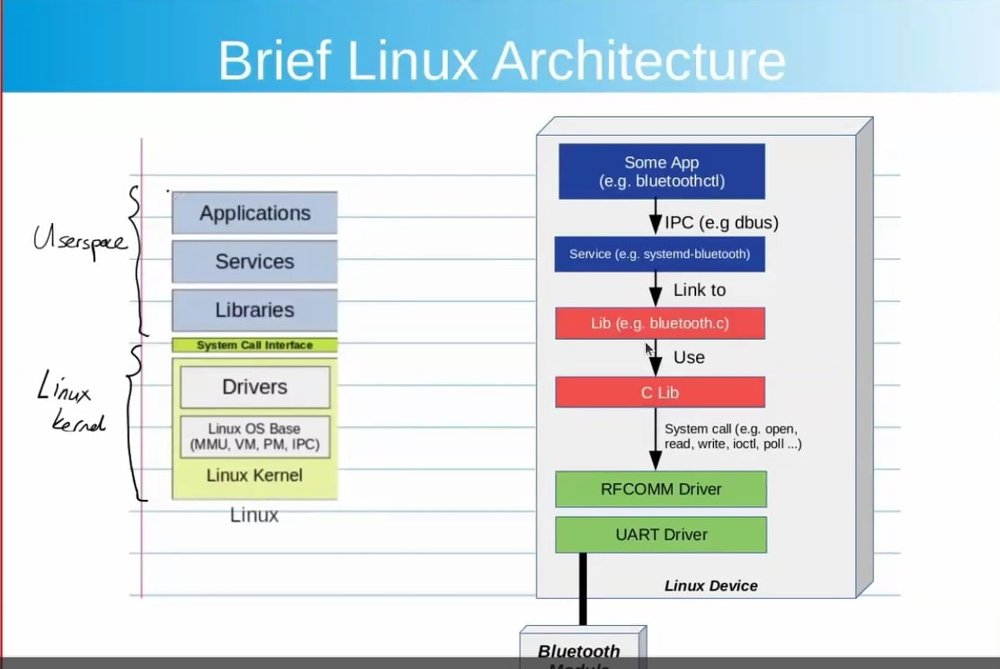
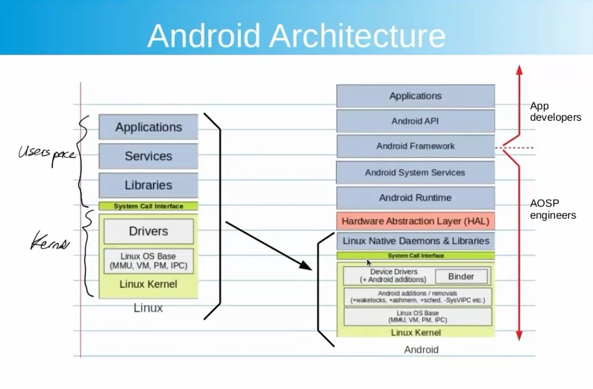
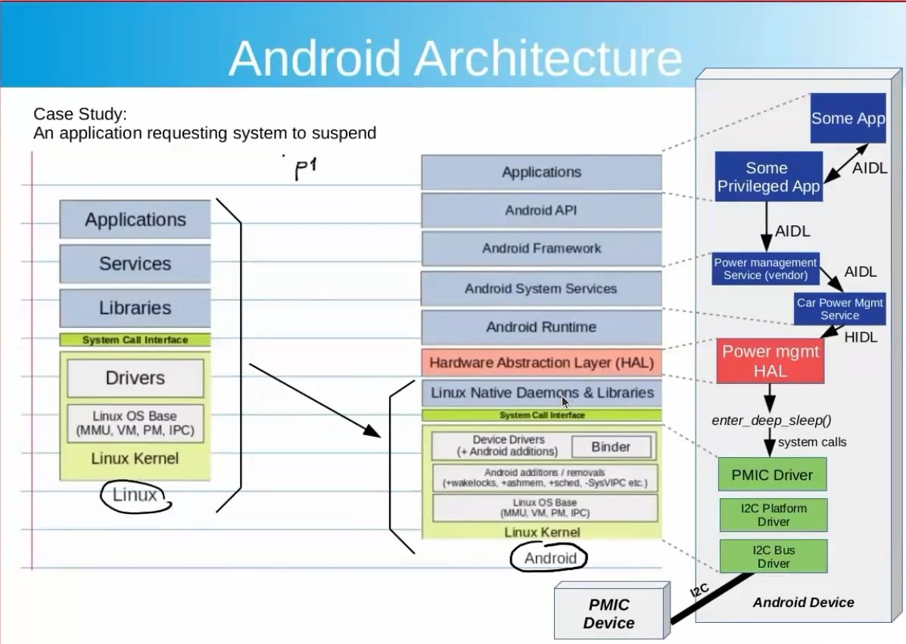
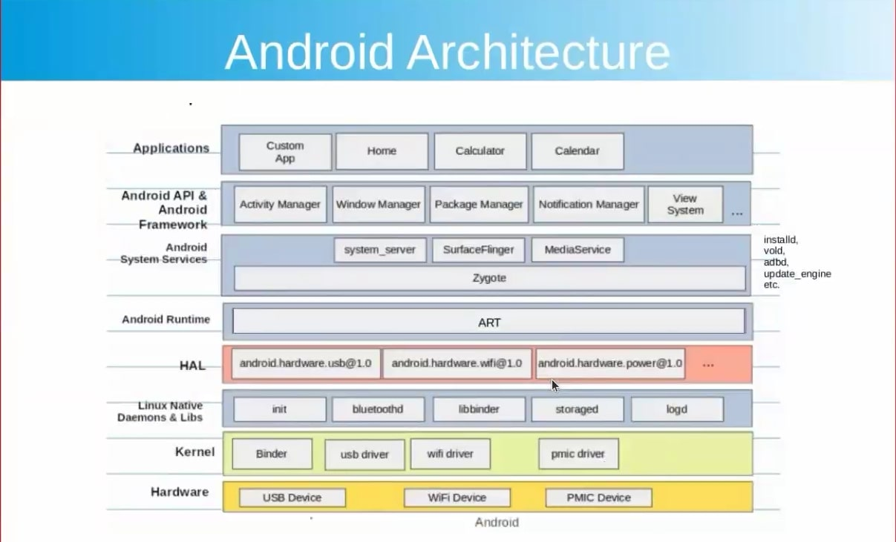
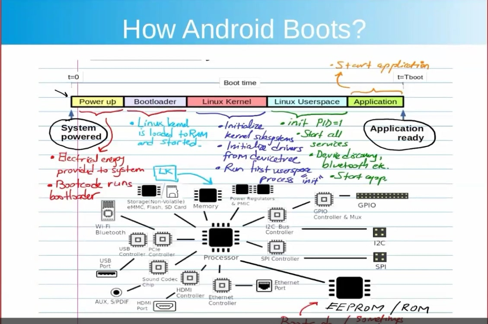

# Android vs Linux – Architecture and Booting Overview

## 📌 What is Linux?
Linux is an open-source operating system kernel used in servers, desktops, and embedded systems.

- Monolithic kernel that manages system resources and hardware.
- Modular and used in distributions like Ubuntu, Fedora, and Android.

---

## 📌 What is Android?
Android is an open-source OS built on the Linux kernel, designed for mobile and embedded devices.

- Started as a digital camera OS, acquired by Google in 2005.
- Uses Linux kernel + custom framework + application layer.

---

## 🧱 Linux Architecture

**User Space:**
- Applications
- Services
- Libraries

**System Call Interface** – Boundary between user and kernel space.

**Kernel Space:**
- Device Drivers
- Protocols (IPv4, PPP, etc.)
- Linux Kernel



---

## 🧱 Android Architecture

**Application Layer:**
- Applications (.apk, .java, .dex)
- Android API

**Framework Layer:**
- Android Framework (Activity Manager, etc.)
- Android Runtime (ART)
- System Services

**Native Layer:**
- HAL (Hardware Abstraction Layer)
- Native Daemons & Libraries

**Kernel Layer:**
- Linux Kernel + Android Additions (Binder, LMK, Wake Locks)





---

## 🔍 Android vs Linux – Key Differences

| Feature                | Linux                          | Android                                 |
|-----------------------|---------------------------------|------------------------------------------|
| Kernel                | Standard Linux Kernel           | Modified Linux Kernel                    |
| C Library             | glibc, musl                     | Bionic C Library                         |
| IPC Mechanism         | System V IPC, POSIX             | Binder IPC (`/dev/binder`)              |
| Logging               | `dmesg`, `systemd`              | `dmesg`, `logcat` (many logs)           |
| Memory Management     | Standard                        | LMK (Low Memory Killer)                 |
| HAL Layer             | Not Standardized                | Standard HAL                             |
| Use Case              | General Purpose (Server, etc.)  | Mobile Devices                           |

  

---

## 🚀 Android Booting Process

1. **Boot ROM**: Executes bootloader from fixed location.
2. **Bootloader**: Initializes hardware and loads kernel + ramdisk.
3. **Linux Kernel**: Boots system, mounts rootfs, starts `init`.
4. **Init Process**: Reads `init.rc`, starts daemons (e.g., `zygote`).
5. **Zygote**: Preloads classes, starts app processes.
6. **System Services**: ActivityManager, WindowManager, etc.
7. **Launcher/Home App**: Loads UI.
  
---

## 📋 Special Notes

- No System V IPC → Uses **Binder** for RPC.
- Android kernel is **low memory + CPU** optimized.
- Logging:
  - Linux: `dmesg`, `systemd`
  - Android: `dmesg`, `logcat`
- HAL abstracts hardware for consistency across devices.

- ## 🧩 Binder IPC Architecture

**Key components:**

1. **Binder Driver** (`/dev/binder`)  
   - Kernel-space driver managing IPC transactions between processes.

2. **Service Manager**  
   - Maintains a registry of system services.
   - Helps clients find and access services.

3. **Client (Caller App)**  
   - Calls a remote method using a **proxy**.

4. **Server (Service/App)**  
   - Implements a **stub** to receive method calls from the client.

---

## 📦 Binder IPC Flow Diagram (Textual)

```text
+------------+          Binder IPC           +-------------+
|  Client    | --------------------------->  |  Server     |
| (App/Proc) | <---------------------------  | (Service)   |
+------------+        Response                +-------------+
       |                                         |
    Proxy                                  Stub Interface
       |                                         |
    Java Code    -> Native Code -> Kernel -> Native Code -> Java Code
```

---

## 🛠 Binder in Action: Zygote Example


---

